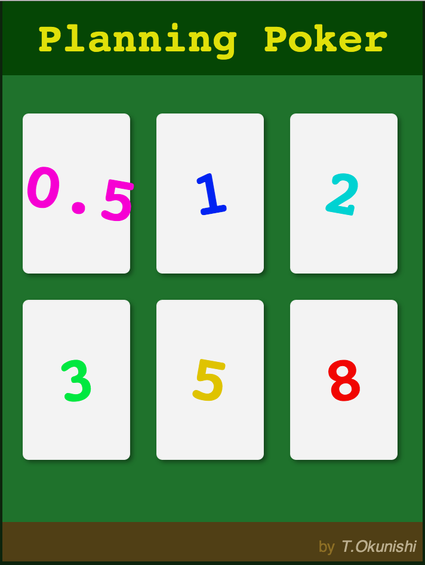

PlanningPoker
=============

A HTML5 app for [planning poker](http://en.wikipedia.org/wiki/Planning_poker) of agile development.

[PlanningPoker]: http://okunishinishi.github.io/PlanningPoker/

## [Play it now!][PlanningPoker]

[][PlanningPoker]

Donation
-------

[gittip-okunishinishi]: https://www.gittip.com/okunishinishi/

Support this project and [others by okunishinishi][gittip-okunishinishi] via [gittip][gittip-okunishinishi].

[][gittip-okunishinishi]

license
-------
This software is released under the [MIT License](https://raw.github.com/okunishinishi/PlanningPoker/master/LICENSE).
